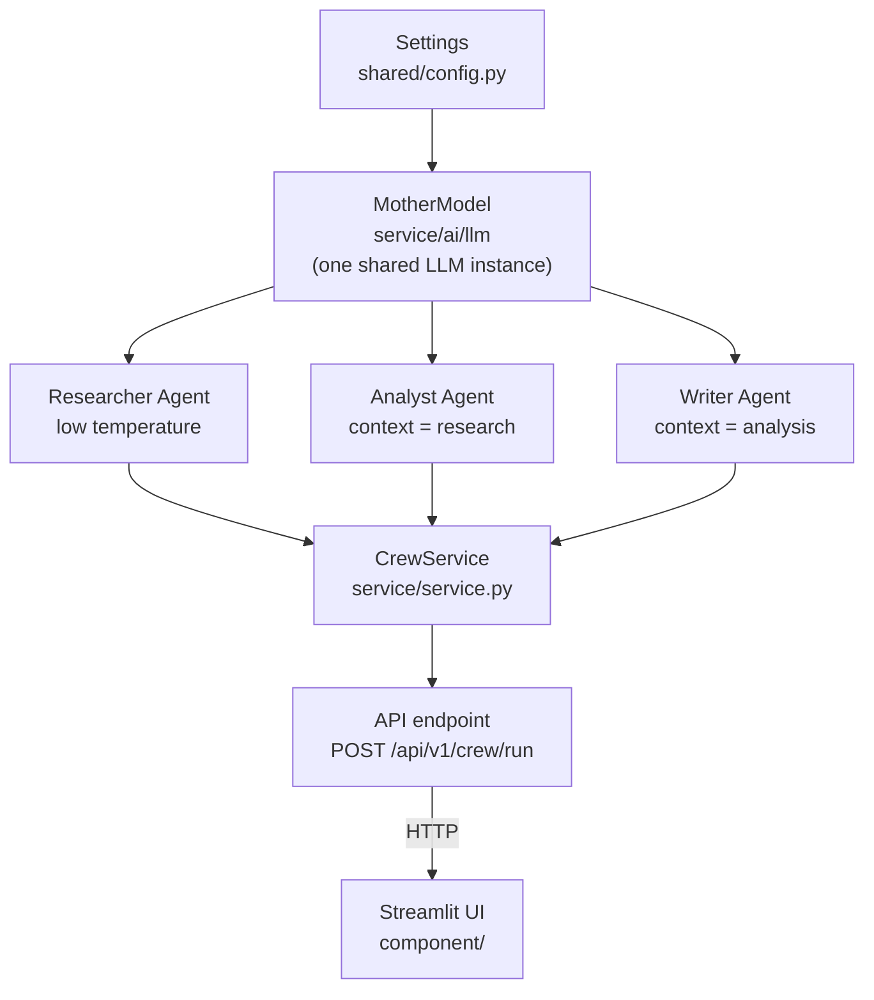

# Exam — CrewAI Mother-Model API

FastAPI + CrewAI service where three task agents (Researcher, Analyst, Writer) share one **mother model** LLM through a dedicated class, fronted by a versioned API and a Streamlit UI.

## Architecture



Every arrow is a hand-off, not a shortcut: nothing below `MotherModel` ever constructs its own `LLM`, and nothing outside the API can reach the agents at all — Streamlit only ever talks to the API over HTTP.

## Branch map

Six feature branches build the chain bottom-up; each merges into `develop` before the next one starts, and `develop` merges into `main` once the whole thing runs end to end.

| Branch | Owns | Depends on | Merges into |
| --- | --- | --- | --- |
| `feat/shared` *(new)* | `app/shared/config.py` | `develop` | `develop` |
| `feat/service` | `app/service/ai/llm/mother_model.py`, `app/service/ai/agent/*.py`, `app/service/service.py` | `feat/shared` | `develop` |
| `feat/api` | `app/api/v1/endpoints/crew.py` | `feat/service` | `develop` |
| `feat/v1` | `app/api/v1/router/api_router.py` | `feat/api` | `develop` |
| `feat/driver` | `app/main.py` | `feat/v1` | `develop` |
| `feat/component` | `app/component/*.py` (Streamlit UI) | `feat/driver` | `develop` |
| `develop` | integration branch — every feature branch above merges here | all six above | `main` |
| `main` | release branch — merged from `develop` once verified end to end | `develop` | — |

> **Open question:** router aggregation (`feat/v1`) and the endpoint handler (`feat/api`) are split into two branches here — confirm that matches the exam's intent, or collapse them into one branch if not.

## Environment prerequisites

Done once, before touching any branch.

- venv lives at `C:\venvs\exam-env`, outside the project path — an apostrophe in `azad's project` breaks numpy's build tooling if the venv sits inside it.
- Install `crewai` alone first, then everything else, so pip's resolver can't backtrack into an old `crewai` version:
  ```
  pip install "crewai[tools]"
  pip install fastapi "uvicorn[standard]" streamlit requests python-dotenv
  ```
- After install: `pip freeze > requirements.txt` and commit that file.
- `.env` at the `exam` root (never committed):
  ```
  GEMINI_API_KEY=your_key_here
  MOTHER_MODEL=gemini/gemini-2.5-flash
  MOTHER_MODEL_TEMP=0.7
  ```
- `.gitignore` includes `.env`.

## Build instructions by branch

**feat/shared** — `app/shared/config.py`: the `Settings` class. Reads `GEMINI_API_KEY` (required, fails loudly if missing), `MOTHER_MODEL`, and `MOTHER_MODEL_TEMP` from the environment. Nothing else in the app reads an env var directly.

**feat/service** — three files: `app/service/ai/llm/mother_model.py` (the `MotherModel` class — owns the one shared `LLM` instance, exposes `get_llm(temperature=None)`); `app/service/ai/agent/*.py` (the three `Agent`s — Researcher, Analyst, Writer — each built from `mother_model.get_llm(...)`, their three chained `Task`s, and a `build_crew(mother_model)` function); `app/service/service.py` (the function an endpoint calls, e.g. `run_crew(topic: str) -> str`, which gets the mother model via `get_mother_model()` and calls `build_crew(...).kickoff(...)`).

**feat/api** — `app/api/v1/endpoints/crew.py`: the `POST /run` route handler. Thin on purpose — it calls `service.run_crew(...)` and returns the result; no crew or agent logic lives here.

**feat/v1** — `app/api/v1/router/api_router.py`: aggregates the endpoint router(s) under the `/api/v1` prefix. This is what `main.py` mounts.

**feat/driver** — `app/main.py`: creates the FastAPI app, loads `.env` via `python-dotenv`, mounts the v1 router.

**feat/component** — the Streamlit UI: a topic input, a Run button, and an HTTP call (via `requests`) to `POST http://localhost:8000/api/v1/crew/run`, displaying the returned result.

## Git workflow

Same sequence for every branch in the map above — pull `develop` before branching off it, so each branch starts from the latest merged state:

```
git checkout develop
git pull origin develop
git checkout -b feat/shared        # or: git checkout feat/service (branch already exists)
# ...write the files for this branch...
git add app/shared/config.py
git commit -m "feat(shared): add Settings config"
git push -u origin feat/shared
# open a PR feat/shared -> develop on GitHub, review, merge
git checkout develop
git pull origin develop
# now start the next branch in the map above
```

## Verification before each merge

Run before opening the PR for that branch.

| Branch | Check |
| --- | --- |
| `feat/shared` | `python -c "from app.shared.config import Settings; print(Settings().mother_model_name)"` runs without a `KeyError` — means `GEMINI_API_KEY` is set and readable |
| `feat/service` | `python -c "from app.service.ai.llm.mother_model import MotherModel; print(MotherModel().get_llm())"` builds without error, then one real `crew.kickoff()` run on a trivial topic confirms all three agents actually respond |
| `feat/api` | with `uvicorn` running, `curl -X POST http://localhost:8000/api/v1/crew/run -d "{\"topic\":\"test\"}"` returns a result, not a 500 |
| `feat/v1` | `http://localhost:8000/docs` (Swagger UI) shows the `/api/v1/crew/run` route |
| `feat/driver` | `uvicorn main:app --reload` starts with no import errors |
| `feat/component` | `streamlit run app/component/streamlit_app.py` loads, submits a topic, and shows a result pulled from the running API |
